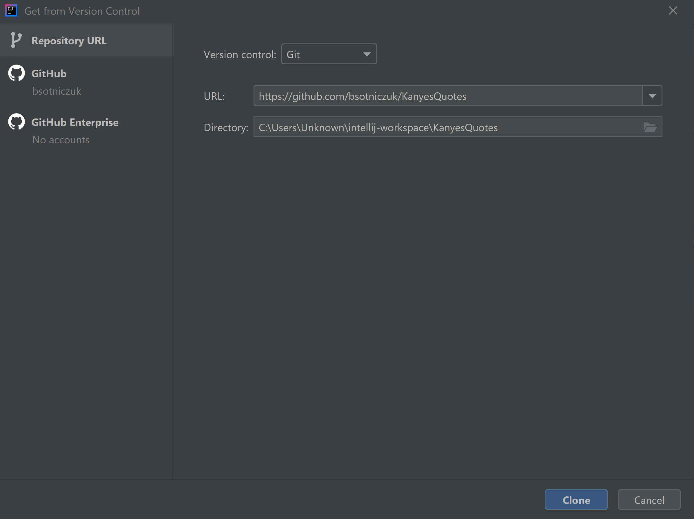
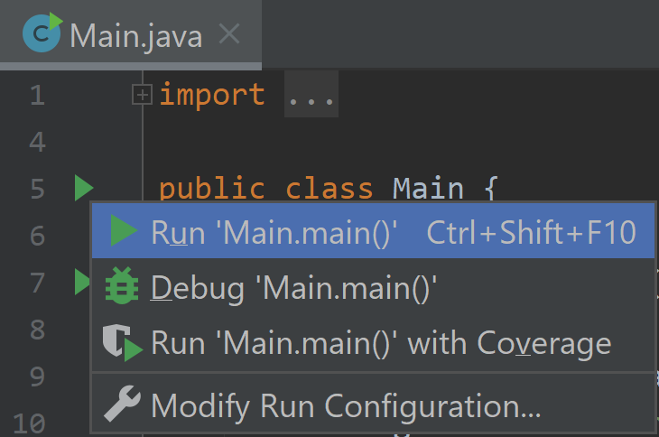

###### How to use:
1) Open Jetbrains IntelliJ IDE if installed or download and install from: https://www.jetbrains.com/idea/download
2) Click "File" tab in the top left corner
3) Click "New" -> "Project from Version Control". "Get from version control" window will open
4) In the newly opened window, choose "Repository URL"
5) Choose "Git" from the "Version control" drop-down list
6) Paste https://github.com/bsotniczuk/KanyesQuotes in the URL tab like in the image below  optionally change the default directory
7) Click "Clone" button in the bottom right corner
8) After successful cloning, open the project tab by pressing Alt+1 on Windows or Options+1 button combination on Mac
9) From the "Project" tab open "src" -> "main" -> "java" folders and open the "Main" file
10) To run an application, click Ctrl+Shift+F10 button combination on Windows or click on a top green arrow present next to the "public class Main {" text and then click Run 'Main.main()' in the popup window like in the image below 
11) After running the application a system console on the bottom will appear, prompting user to enter a number. After successfully entering the number a program will complete its tasks and show the results to a user in a system console.